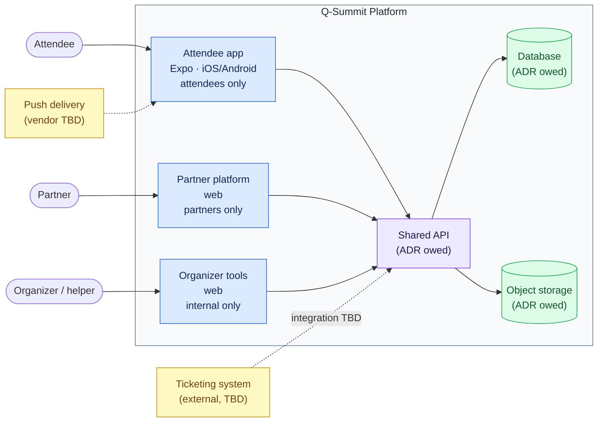

# 3 · Context and scope

<!-- arc42 section 3: C4 Context level, Mermaid (renders on GitHub). -->

## System context

_All three surfaces cross the shared API. The attendee app runtime is Expo ([ADR-0002](../decisions/0002-expo-attendee-mobile.md)). Database, object storage, ticketing, and push are not decided deployments; each needs an ADR before first use. Dotted edges are external integration points, not part of the platform._

## Scope notes

- **One shared API, three consumers.** No surface talks to the database directly; persona-based authorization lives in the API.
- **External systems** (ticketing, push delivery) and undecided internals (database, auth, object storage layout) each require an ADR before first use; see [section 9](09-architecture-decisions.md).
- **Out of scope for now:** post-conference and year-round features; anything depending on parked capabilities (see [section 2](02-constraints.md)).

<!-- Container-level view (C4 L2) gets added here when the first
     implementation ADRs land (database, auth, monorepo layout). -->
