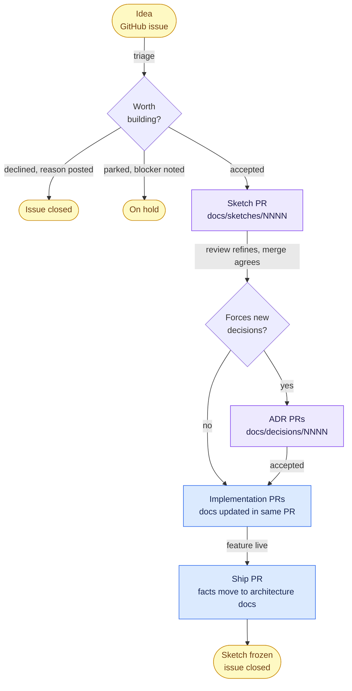

# The feature workflow

How an idea becomes a shipped feature in this repo. The principle: **GitHub Issues are the front door; after acceptance, everything is code.** An idea's whole life (refinement, decisions, implementation, current status) is readable from the repo and its PR history alone.

## The workflow at a glance

_Every stage is a GitHub object (an issue or a PR), so the current state of any feature is always visible without asking anyone._

## Two kinds of decisions (read this first)

The system separates two things that are easy to blur:

- **A sketch is a feature decision.** _What are we building, for whom, and how will it be implemented on the architecture we have?_ One page per feature in [`sketches/`](sketches/).
- **An ADR is an architecture decision.** _Which database, which auth model, where does this run? Chosen among alternatives, for the whole system._ One file per decision in [`decisions/`](decisions/).

**Features drive architecture.** A sketch's technical plan tries to run on the existing architecture. Where it can't (it needs a capability no ADR has decided yet), that gap _forces_ an ADR. Several features can lean on one ADR; one feature can force several. The sketch links the ADRs it forced; the ADR links the sketch that triggered it. Neither replaces the other.

**Where's the line? A few worked examples.** The test is "were there real alternatives worth weighing system-wide?"

- _"Which database, and how do we cache for offline?"_ Real alternatives, affects every surface: an **ADR**.
- _"Do we add a `tier` column to one feature's entries so paid slots can exist later?"_ A local data-model choice inside one feature, no system-wide alternatives: it stays in the **sketch's** technical plan.
- _"Which date-formatting library?"_ An implementation detail with no cross-surface consequence: neither; it is a normal code-review call in the implementation PR, not a documented decision at all.
- _"One auth system across all three surfaces, or per-surface?"_ System-wide with real alternatives: an **ADR**, and the first feature that crosses surfaces forces it.

When in doubt: if you cannot name two options that were genuinely on the table, it was not an architecture decision. Write it in the sketch and move on.

## Where ideas come from

Anyone can propose anything with the **💡 Idea** issue template. Three intake paths, one system of record:

| Proposer | Path |
| --- | --- |
| Core team / IT | Files the issue directly |
| Partner | Tells their Q-Summit contact person, who files it ("I'm relaying it" plus who to keep in the loop) |
| Attendee | Feedback reaches the team (forms, in-app feedback later); whoever receives it files it |

The template asks for source, what, why, which user groups it touches, and optional timing/contact. Rough is fine; triage refines.

## Stages

### 1 · Idea (GitHub Issue)

- Labels: `idea` on creation; triage adds `persona: *`.
- **Triage** (regular IT sync, or async when obvious): first check for duplicates and merge threads, then decide:
  - **Accepted** → label `accepted`, a sketch owner is assigned. Proposers don't have to write the sketch; IT does, with them.
  - **Declined** → close with a comment saying why. Kind, specific, on record.
  - **Parked** → label `parked`, blocker noted (e.g. legal review pending).
- The outcome is always posted in the thread. That's the feedback loop for people who only see the issue.

### 2 · Sketch (a PR that adds one page)

The accepted idea becomes `docs/sketches/NNNN-<slug>.md` (next free number, template: [`sketches/_template.md`](sketches/_template.md)), opened as a PR.

- **The PR review is the refinement.** By the time it merges, the team has actually agreed. Merging means _"this is what we'd build"_, not _when_.
- The heart of the sketch is the **persona matrix** (who can do what, who sees what: the scoping and review starting point; authoritative access rules accumulate in [`architecture/08-concepts.md`](architecture/08-concepts.md)) and the **technical plan** (where it runs, what data changes, what it reuses, and crucially which **new architecture decisions it forces**).

### 3 · Decide (ADRs, only when forced)

Each new decision the technical plan surfaced becomes an ADR PR (`docs/decisions/NNNN-<slug>.md`, status **Proposed**; template: [`decisions/_template.md`](decisions/_template.md)).

- The ADR PR thread is the debate; merging means **Accepted**.
- ADRs are append-only: course changes are new ADRs that supersede old ones.
- ADRs answer system questions (_which database, which auth, which host_) with alternatives weighed. If there were no alternatives, it wasn't a decision; put it in the sketch.
- Features whose technical plan fits entirely inside existing ADRs skip this stage.

### 4 · Build (implementation PRs)

The sketch's technical plan is broken into a task-list checklist inside the sketch (or a tracking issue for big features). Every implementation PR:

- references the sketch and any ADRs it implements,
- is reviewed against the sketch's persona matrix,
- **updates the docs it invalidates in the same PR**: the sketch (while building), the architecture sections, the diagrams. The PR template asks.

### 5 · Shipped (the sketch freezes, the truth moves)

When the feature is live, the shipping PR does the handoff:

1. **Migrate the durable facts into the architecture docs**: structure into [`architecture/05-building-blocks.md`](architecture/05-building-blocks.md), behavior into [`architecture/06-runtime.md`](architecture/06-runtime.md), data model and crosscutting rules into [`architecture/08-concepts.md`](architecture/08-concepts.md).
2. Set the sketch's status to `shipped` and fill its `landed-in:` frontmatter with links to those sections.
3. Close the idea issue with a link.

**From then on the sketch is frozen**: a point-in-time record of what we planned, like a merged RFC. It is never updated again; the architecture docs are the current truth. Files never move; there is no archive folder. The status field and the index below do that job without breaking links.

## Who owns which state (no double-bookkeeping)

Exactly one place owns each piece of state:

| State | Owner | How to read it |
| --- | --- | --- |
| Idea under discussion | GitHub | Issue open with `idea`, no `accepted` label |
| Idea accepted / parked / declined | GitHub | `accepted` / `parked` label; declined = closed with comment |
| Sketch being refined | GitHub | Sketch PR open |
| Sketch agreed | git | The sketch file exists on `main` (the merge is the agreement) |
| Feature agreed, build not started | Sketch frontmatter | `status: planned` (the default after merge) |
| Feature in build | Sketch frontmatter | `status: building` |
| Feature agreed, then put on hold | Sketch frontmatter | `status: parked` (blocker noted in the sketch or linked issue; distinct from an idea-issue `parked` label) |
| Feature live | Sketch frontmatter | `status: shipped` plus `landed-in:` |
| Current system truth | `docs/architecture/` | Always |

Anything derivable from GitHub-native state (open/closed, linked PRs) gets no label. Hand-maintained duplicates drift.

## Labels

`idea` · `bug` · `persona: attendee` · `persona: partner` · `persona: organizer` · `accepted` · `parked`. That's all. Created once via [`scripts/setup-labels.sh`](../scripts/setup-labels.sh).

## Review ownership and merge rules

- [`CODEOWNERS`](../.github/CODEOWNERS) is authoritative for review ownership. Target model: sketches and code reviewable by the whole IT team; `docs/decisions/`, `docs/architecture/`, and `.github/` require a maintainer. Until the org teams exist, a single maintainer owns everything.
- `main` is protected: no direct pushes, every change lands via PR with **one approving review**, passing checks, and a signed CLA. One approval, not two; volunteer teams stall at two.

## Numbering and naming

Sketches and ADRs are numbered independently, four digits, never reused. Assigned when the PR is opened; renumber if you race another PR. The H1 of every sketch and ADR is `NNNN · Title` (middle dot, not a dash).

## Enforced structure

CI validates the structure this page describes: sketch and ADR frontmatter, filenames and numbering, required sections (the templates are the source of truth; see [`sketches/_template.md`](sketches/_template.md) and [`decisions/_template.md`](decisions/_template.md)), the index tables here and in [`architecture/09-architecture-decisions.md`](architecture/09-architecture-decisions.md), that every relative link in `docs/` resolves, that every `AGENTS.md` has a sibling `CLAUDE.md` importing it (`@AGENTS.md`), that skills live canonically in `.agents/skills/` with `.claude/skills` as a single symlink to it (`pnpm run setup` repairs it), and the house writing style (no em or en dashes in the paths `validate-docs` scans (docs/, listed root guides, .agents/skills, .github/, scripts/; see `AGENTS.md`)). Markdown style and spelling are checked too (markdownlint, cspell, prettier). Run everything locally from the repo root: `pnpm run check`. PRs with violations are blocked until green. Outside the PR gate, CI also probes external links weekly (lychee, files an issue on rot) and lints the workflows themselves on change (actionlint plus zizmor).

What CI deliberately does **not** check is judgment: whether a technical plan is actually complete, whether an ADR truly weighed its alternatives, whether a persona matrix is right. Those are the reviewer's job. We machine-check structure (which is objective) and leave meaning to review (which is not); a green check means well-formed, never well-thought-out. So the technical-plan bullets in the sketch template are prompts to answer in review, not a CI gate.

## Index of sketches

| #   | Feature | Status |
| --- | ------- | ------ |

None yet. First sketch is `0001`. Keep this table current in the same PR that adds or changes a sketch's status.
